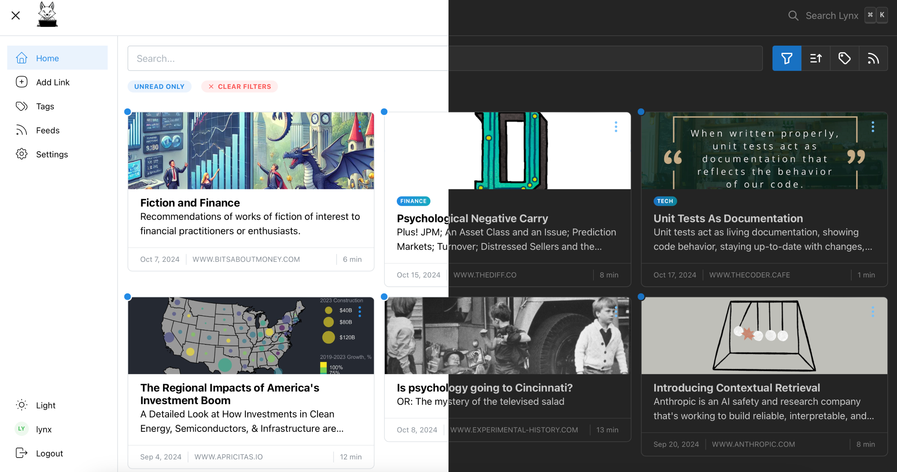
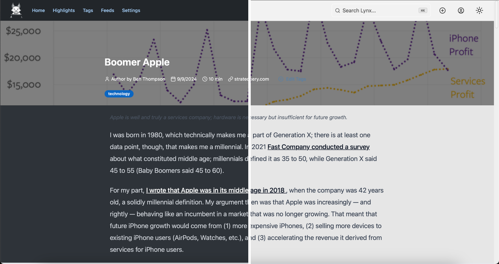

  <picture>
    <source media="(prefers-color-scheme: dark)" srcset="resources/logo_full_light.png" width="50%">
    <source media="(prefers-color-scheme: light)" srcset="resources/logo_full_dark.png" width="50%">
    
  </picture>

Lynx is an easily self-hostable read-it-later service that lets you save articles or passages in the moment and get back to reading them later (eventually). Never worry about losing access to articles due to link rot, as all article content is parsed and saved locally.

    

<picture>
  
</picture>

# Features

- Save links quickly and easily, using the web UI or via a single API call.
- View saved articles in a clean, easily-readable format.
  - Plus, an optional integration with [SingleFile](https://github.com/gildas-lormeau/SingleFile) to save faithful standalone archives of the complete webpage. Build your own internet archive!
- Save highlighted passages from any articles in your collection or from around the web.
- Subscribe to RSS feeds to automatically download and save new articles as they're posted.
- Tagging support lets you quickly find anything in your saved articles.
- Bring your own API key and automatically summarize all articles using the latest LLM hotness.
- Self-hostable via Docker, for ultimate privacy.
  - Plus, multi-user support so friends and family can save their own links.
- SQLite backend (powered by [Pocketbase](https://technology.riotgames.com/news/taxonomy-tech-debt)) for limited dependencies and great performance.
- Light- and dark-mode support out of the box.

<picture>
  
</picture>

# Installation

The primary supported installation method is via Docker. To get up and running quickly:

- Download a copy of the [docker-compose.yml](resources/docker/docker-compose.yml) file from this repository
- Optionally, uncomment the commented sections to enable the integration with Singlefile to attempt to create link archives in your instance.
- Run docker compose with the compose file and you should be able to access lynx at `your-server.com:8080`

# Initial Setup

- Access the Pocketbase backend admin panel at `your-server.com:8080/_`
- The first time you access the admin panel, you'll be prompted to create a new admin user. Keep this login info safe, but it will not be your primary login.
- After logging in, navigate to the `users` collection and create a new user. This will be your primary Lynx login!
- Return to `your-server.com:8080` and login to Lynx using your newly-created user

> [!NOTE]
> There is currently no user management built in to Lynx. In order to add or remove users, or change passwords, you will need to repeat this process. You must login to the admin panel with the admin credentials you created above and then update or create users in the `users` collection.

# Usage

After installation, you can start saving links to your Lynx instance. Use the web interface to add, manage, and read your saved links.

## SingleFile integration
If you enabled the singlefile container and environment variable in your docker-compose and env files, then Lynx will attempt to create a standalone archive of all the pages you save. Any cookies that you have saved within Lynx will also be passed along when archiving, so if you're able to load the page in Lynx then it should also archive correctly.

This process is not perfect and depending on your setup can be slow (it sends an HTTP request to the [lynx-singlefile container](https://github.com/brendanv/lynx-singlefile), which runs headless Chrome to load the page and process everything into a single file) but it works pretty well. 

## Contributing

Contributions are welcome but no guarantees that it will be accepted - I mostly built Lynx for myself so I'm somewhat opinionated on how it should evolve :)

## License

Lynx is released under the MIT License. See the `LICENSE` file for more details.
