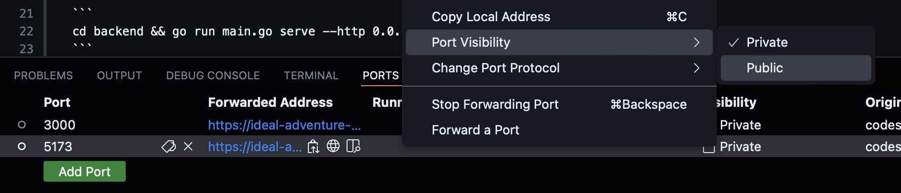

# Setting up a codespace for Lynx

Lynx has a [devcontainers.json](/.devcontainer/devcontainer.json) file configured that should take care of installing dependencies and getting Lynx up and running. Feel free to install any other extensions or tools that you use when developing.

## Making ports available

By default, ports opened in a codespace are not accessible without authentication. This does not work when running Lynx in dev mode because the requests from the frontend do not include any authentication that Github recognizes. So you have to open up the ports for both the frontend and the backend using the Network tab.

The two ports should already be configured when you open the tab, but you must change the visibility to public:



# Running Lynx in a codespace

In order to run and use Lynx when developing, two things need to be running: 1) the go backend and 2) the React frontend in dev mode.

## Running the backend 

To build the backend and run in development mode, run the following command: 

```
cd backend && go run main.go serve --http 0.0.0.0:3000
```

This command is also available as a `Build Task` in the VSCode Command Palette as `Lynx Backend - Dev`.

### Creating your admin user

Once the backend is built and port 3000 is opened, you'll get a prompt to open the page in your browser. Ignore the `Not Found` error and go to `https://<YOUR_CODESPACE>-5173.app.github.dev/_`. Create an admin user with any credentials you want (don't lose them!). Then create a new record in the `users` collection - this will be your actual Lynx login!

## Running the frontend 
To build the frontend and run Vite in development mode, run the following command: 

```
cd frontend && npm run dev
```

This command is also available as a `Build Task` in the VSCode Command Palette as `Lynx Frontend - Dev`.

Once the frontend is built you'll get another prompt to open the newly-available port in your browser. You should see the Lynx login page - log in with your new credentials and you should be able to access Lynx normally.

The dev environment is set with live-reloading so when you edit in the codespace changes should be available ~immediately in your other browser tab.